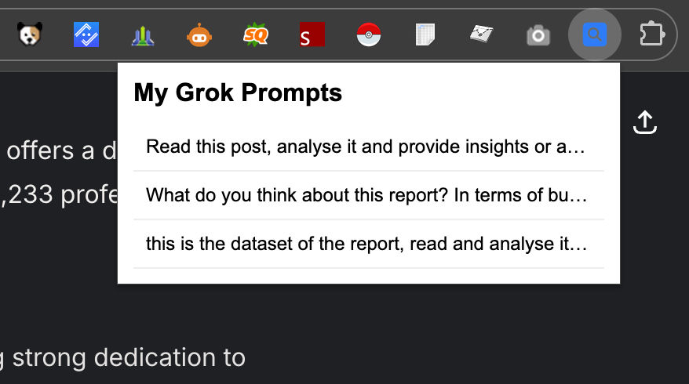

# AI Prompts ToC

This is a Chrome extension that indexes all your prompts in the Grok chat window on `https://grok.com` and provides a Table of Contents (ToC) for quick navigation with auto-scroll functionality.

## Overview
The AI Prompts ToC extension enhances your experience on `https://grok.com` by creating a ToC for your chat prompts. It indexes all your messages in the chat window, displays them in a popup, and allows you to click any prompt to auto-scroll to its location in the chat with a highlight effect. This is especially useful for long conversations where you need to quickly revisit earlier messages.

## Features
- Index Prompts: Automatically detects and lists all user prompts in the Grok chat.
- Table of Contents: Display a list of prompts in a clean popup interface.
- Auto-Scroll: Click a prompt to smoothly scroll to its position in the chat with a highlight effect.
- Dynamic Updates: Update the list when new messages are added to the chat.

Note: This extension only works on `https://grok.com/*`. Other websites like ChatGPT may coming soon.

## Installation

### Prerequisites

- Google Chrome browser (or a Chromium-based browser like Edge).
- The extension files (download from this Repo).

### Installing the extension

1. Open Chrome and go to `chrome://extensions/`.
2. Enable "Developer mode" (toggle in the top right).
3. Click "Load unpacked" and select the folder containing the extension files (the one with `manifest.json`).
4. The extension should appear in your extensions list with the name "AI Prompts ToC".
5. (Optional) Pin the extension for quick access.

## Usage

1. Visit `https://grok.com` for a new chat or open any existing chat.
2. Click the "AI Prompts ToC" icon in your toolbar.
3. A popup will appear listing all your prompts from the chat.
4. Click on any prompt to auto-scroll to its location.
5. As you make new prompts in the chat, the popup will automatically update to include them (you may need to reopen the popup to see the updated list).

## Screenshot



## Contributing
All contributions are welcome.

## Development Notes

- The extension uses a `MutationObserver` to detect new messages, which may need adjustment if the DOM structure of `https://grok.com` changes.
- Ensure any new features are compatible with Chrome’s Manifest V3 requirements.

## Known Issues and Fixes

### "No Requests Found" Issue (May 22, 2025)

#### Problem
The extension started displaying "No requests found" in the popup, even when user messages were present in the chat on `https://grok.com`. This issue occurred because the changing of the DOM structure, breaking the selector used to detect user messages.

#### Cause
The original selector in `content.js` (`div.items-end div.message-bubble`) no longer matched user messages due to a website update. The updated DOM structure for a user message was:

```html
<div class="relative group flex flex-col justify-center w-full max-w-3xl md:px-4 pb-2 gap-1 items-end">
    <div dir="auto" class="message-bubble rounded-3xl prose dark:prose-invert break-words text-primary min-h-7 ...">
        <div class="thinking-container"></div>
        <div class="response-content-markdown ...">
            <p dir="auto" class="break-words" style="white-space: pre-wrap;">Hello, Grok!</p>
        </div>
    </div>
</div>
```

The selector needed to adapt to this new hierarchy, targeting `div.items-end .message-bubble` and extracting text from the nested `<p>` tag.

#### Fix

The issue was resolved by updating the selector in `content.js` to match the new DOM structure. The updated code in `indexRequests` is:

```js
const userMessages = document.querySelectorAll('div.items-end .message-bubble');
```

Text extraction was also adjusted to target the `<p>` tag within `response-content-markdown`:

```js
const textElement = msg.querySelector('div.response-content-markdown p') || msg;
const text = (textElement.textContent || '').trim().replace(/\s+/g, ' ').slice(0, 100);
```

This fix was implemented on May 22, 2025, and the extension now correctly indexes user messages.